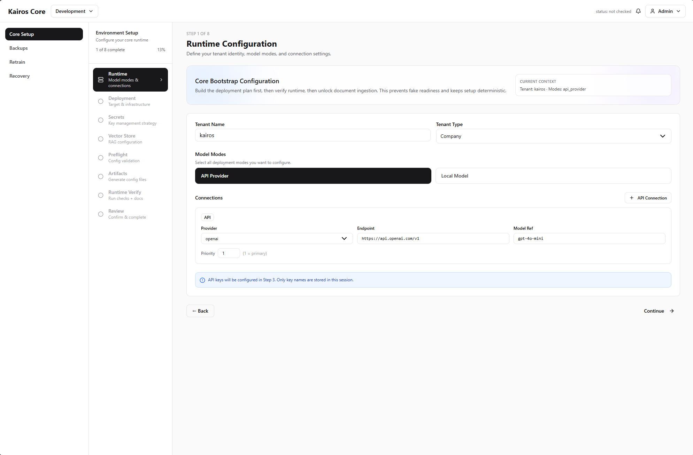
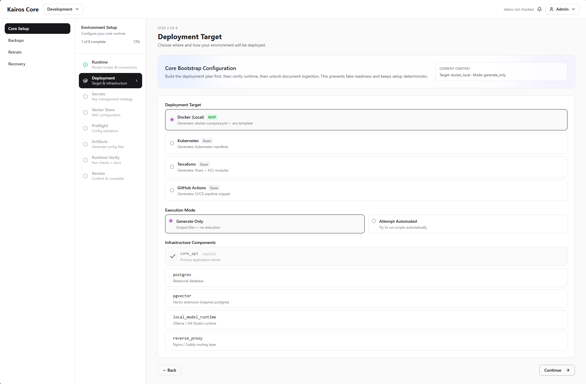
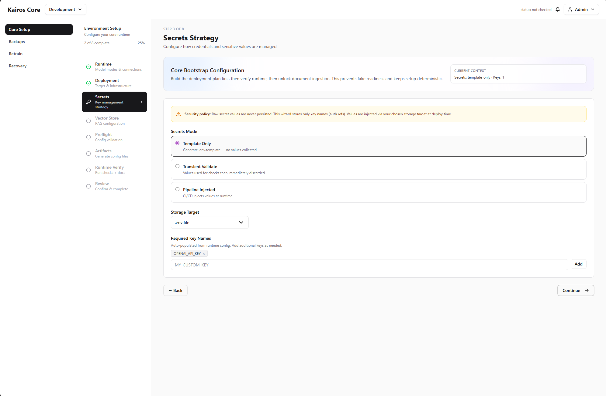
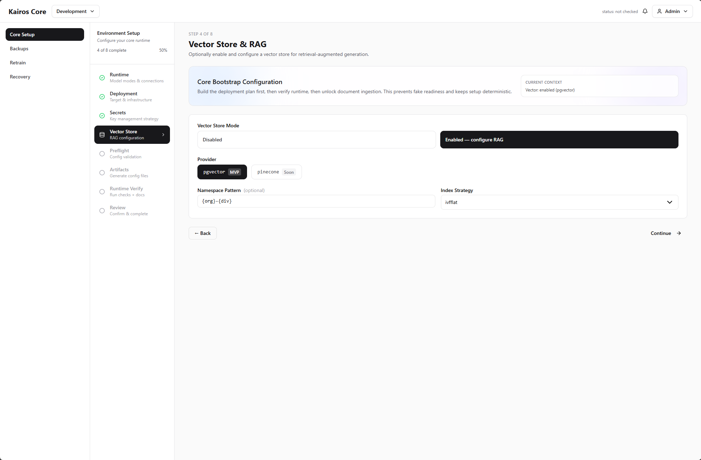
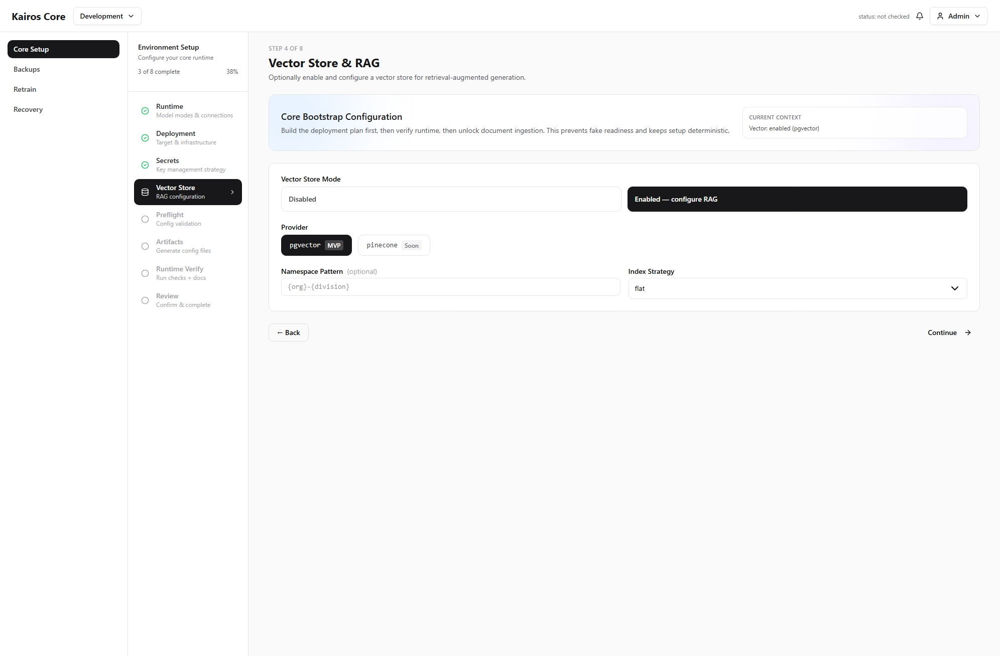
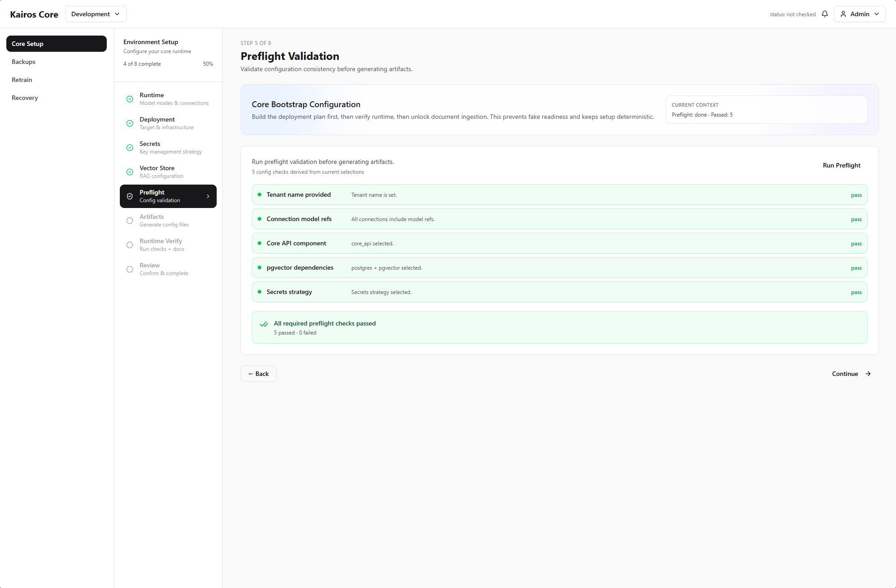
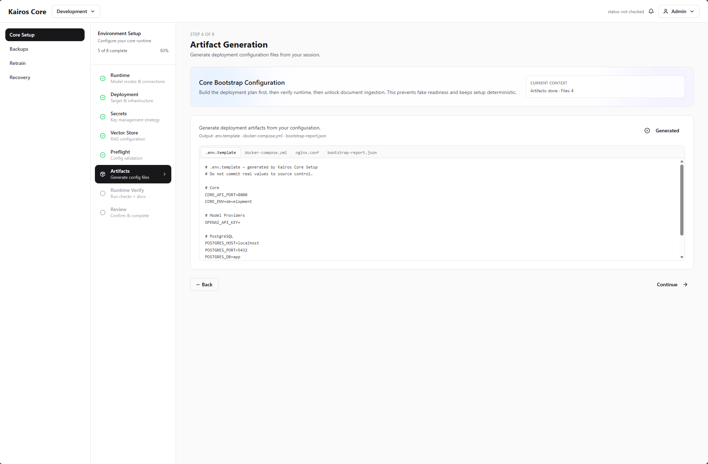

# Frontend

This folder contains the React + TypeScript reference UI for Kairos Core bootstrap/setup.

## Stack

- React + React Router
- TypeScript + Vite
- Tailwind CSS v4
- `@kairosstack/ui` shared component library

## Frontend role in the ecosystem

- Provides the Core bootstrap flow (runtime/deployment/secrets/vector/preflight/artifacts/runtime verify/docs/review).
- Demonstrates shell/layout patterns aligned with Studio while preserving Core-specific responsibilities.
- Acts as reference behavior for external frontend adapters that consume shared contracts.

## Local setup

```powershell
npm install
npm run dev
```

Open the local Vite URL and run through the setup wizard.

## Tailwind + Shared UI package

Tailwind source scanning includes both local app files and `@kairosstack/ui` package files.

- `src/styles/tailwind.css`

If shared component styles appear missing (for example, transparent or compressed dropdowns), restart the dev server after dependency/style changes.

## Wizard screenshots

### Runtime Configuration



### Deployment Target



### Secrets Strategy



### Vector Store



### RAG Option



### Preflight Validation



### Artifact Generation



### Runtime Verify (Failure State)


